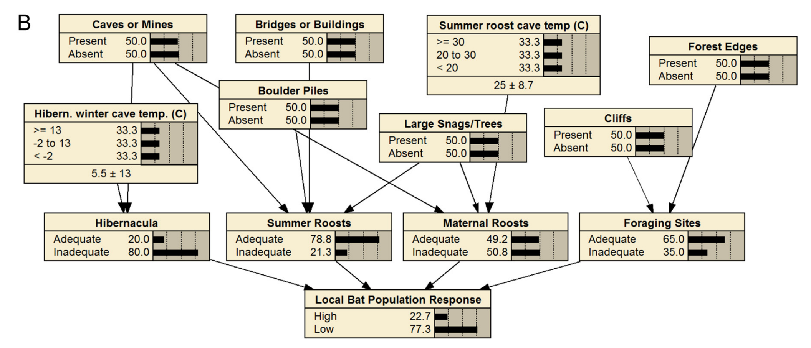

<a name=top>
       

&nbsp;<a href="https://git.io/sin21">home</a> ::
<a href="https://github.com/txt/sin21/blob/master/docs/syllabus.md#top">syllabus</a> ::
<a href="https://github.com/txt/sin21/blob/master/docs/syllabus.md#timetable">timetable</a> ::
<a href="https://docs.google.com/spreadsheets/d/1n0zHiZlVYkLAEg5Lj1CVaLSEaeNy8iYjw8IMWYWs4Tk/edit?usp=sharing">groups</a> ::
moodle(<a href="https://moodle-courses2122.wolfware.ncsu.edu/course/view.php?id=3211">591</a>,
<a href="https://moodle-courses2122.wolfware.ncsu.edu/course/view.php?id=3211">791</a>) ::
video <a href="https://ncsu.hosted.panopto.com/Panopto/Pages/Sessions/List.aspx#folderID=a5998f03-01df-4c6c-91c1-ad80003f3c7c">tbd</a> ::
<a href="https://github.com/txt/sin21/blob/master/LICENSE.md#top">&copy; 2021</a>
 

# Explaining Explanation

## Explanation and  Ethics

"Models induced from data must be liable as liability will likely
soon become a legal requirement.
- "Article 22 of the General Data
Protection Regulation (GDPR) sets out the rights and obligations
of the use of automated decision making.
- "Noticeably, it introduces
the right of explanation by giving individuals the right to obtain
an explanation of the inference/s automatically produced by a model,
confront and challenge an associated recommendation, particularly
when it might negatively affect an individual legally, financially,
mentally or physically. "

"By approving this GDPR article, the European
Parliament attempted to tackle the problem related to the prop agation of potentially biased inferences to society, that a
computational model might have learnt from biased and unbalanced
data."

So explanation and ethics are linked.

Lets talk about theories of explanation.

## Background

- Induction: (learn  where we can run) Give lots of examples of (premise,conclusion), make a  rule
- Deduction: (run  forward)  Give rules and a premise, make a conclusion
- Abduction :  (run backwards) Given a rule and a conclusion, assume a premise

Abduction == "guessing"  and guesses can be  wrong

- Rule1: grass is  wet cause  it rained
- Rule2: grass is wet cause of the  sprinkler
- Conclusion: grass is wet:
  -  what  is  our premise?

Abduction  == the  logic of guessing

- Work  backwards over the  rules.
- Make assumptions
- Group together consistent  assumptions
- Find the  _base assumptions_ (those that decedent on nothing else)
- Monitor for evidence for the base
- Jump between assumption sets based  on  that  evidence

JTMS vs ATMS

- JTMS: only every hold one world of consistent  believes
  - Spend too much  time jumping to another world?
- ATMS: weave all the _worlds of belief_ together, in indexed by  the base assumptions.
  - All known ATMS exponential runtime

## Next

- Menzies abduction, [1996](96abok.pdf)
- Menzies abduction [2017](shorter.pdf)
- Current thinking (May 2020) on [explanation](Explainable_Artificial_Intelligence_a_Systematic_R.pdf)

## Notes on learner types

Generation methods
- Expert systems: lots of rules, often built manually   via expert intervie
  - These days, ES  usually augmented with leaners

Learner goals:

- regression: target  class is numeric
  - multi-regression: N target classes
  - multi-objective:  targets have weights (things to avoid or leap towards)
-  classification: target  class is symbolic
- REcommender systems: 
  - not _what is_ but
  - _what  to change_.
  - think "recommender system" is analogous  to "optimizer"
    - but for  symbolic systems.

Learner outputs:

- Bayesian networks 
  - directed graph
  - child parent beliefs are initialized with a _prior_
  - then updated with evidence  that  flows from their parents
  - a modeling  framework that allows experts to
    - initialize a model with their  beliefts
    - then  udpate  that belief when new evidence  arrives.
- Rules: combinations of ranges (e.g. age over 60 and name == tim) that denote regions (technically, a volume in  N-d space)
  that selects  for some desired goal
- Neural networks
  - Rules report regions  in  the  data, using the  raw attribute names
  - SVMs add in new names (from the kernel, see below)
  - Neural nets ignore all the raw names
    - write  input into layers of  nodes, each of which might connect
      to the other
    - learns weights on the  edges between nodes
  - No "grandmother cell".
- Support vectors:
  - Given data with a  boundary between  regions, support vectors
  are  the examples closest to the boundary (border guards).
  - 10,000s of examples may only have  a few dozen, a few  hundred,
     border guards
  - Support  vector machines (SVM): devices to find the border guards that use
    the  _kernel  trick_:
    - when data can't be neatly separated,  add another dimension
      that better  divides .
      - which kernel to use? hyper-parameter optimization!
  - BTW, support vectors are not rules
    - they are an instance-based representation

