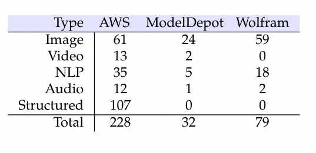

<a name=top>
       

&nbsp;<a href="https://git.io/sin21">home</a> ::
<a href="https://github.com/txt/sin21/blob/master/docs/syllabus.md#top">syllabus</a> ::
<a href="https://github.com/txt/sin21/blob/master/docs/syllabus.md#timetable">timetable</a> ::
<a href="https://docs.google.com/spreadsheets/d/1n0zHiZlVYkLAEg5Lj1CVaLSEaeNy8iYjw8IMWYWs4Tk/edit?usp=sharing">groups</a> ::
moodle(<a href="https://moodle-courses2122.wolfware.ncsu.edu/course/view.php?id=3211">591</a>,
<a href="https://moodle-courses2122.wolfware.ncsu.edu/course/view.php?id=3211">791</a>) ::
video <a href="https://ncsu.hosted.panopto.com/Panopto/Pages/Sessions/List.aspx#folderID=a5998f03-01df-4c6c-91c1-ad80003f3c7c">tbd</a> ::
<a href="https://github.com/txt/sin21/blob/master/LICENSE.md#top">&copy; 2021</a>
 

## Eg4: Model stores

If you can do something fast, then you can also do _bad_ things fast. For example, there are tools that 
can take any Github repo, container-ize it, then drop it up onto AWS as a web service. Crappy prototype
to slick interface in a matter of seconds.

Machine learning methods can be packaged and executed in cloud "containers"  (e.g. using tools like opendatahub.io).
Many such containers are  available for rent, in [model stores at 
[AWS marketplace](https://aws.amazon.com/marketplace/solutions/machinelearning/)
and [elsewhere](https://resources.wolframcloud.com/NeuralNetRepository)
Users rent these models plus the  CPU needed to run them. They  upload their data and,
later, the model returns  labels (conclusions).

 As seen in the following table,
a [study by Xiu et al. in  Jan'21](https://arxiv.org/pdf/1905.10677.pdf)
  found over 300 such models-for-rent.
Given the current interest in  commercial AI, it is expected that these numbers will soon grow much larger.

These models make decisions that could   inappropriately affect different 
social groupings defined by  age, gender, or race. For example, in the AWS model store,

-   _Credit Default Predictor_  uses attributes 
like gender, education, age, and previous history of payments. 
Assessing the fairness of _Credit Default Predictor_ 
is an important task since such predictors have the potential to perpetuate social inequities 
(e.g. it is hard to break the cycle of poverty if your zip code prevents you from access a line of credit). 
- Also in the AWS model store, the
_Hospital Readmission_  model predicts the probability that a patient will not be readmitted after discharge. This model's inputs include financial class, sex and age. 
It is important to assess the  fairness of _Hospital Readmission_ since it is highly inappropriate (and dangerous)  to affect a patient's life expectancy due to their (e.g.)  social status. 

So how to trust that model stores are not dispensing discriminatory models that are unfair to certain social groups?
This is an important question since:

- Given the  ubiquity of the internet, model stores can unleash discriminatory models to a  wide audience.
- Currently,  the fairness of the models is unknowable.
Model store models usually have no tools for (a) measuring or (b) mitigating discriminatory bias. 

This second point is particularly troubling since
[Xiu et al.](https://arxiv.org/pdf/1905.10677.pdf) warn that over 70% of these models are early lifecycle research prototypes.
As such, we should as the very least routinely apply some kind of fairness verification
process to the models in model stores.

## TODO

- Read the [Xiu et al. article](https://arxiv.org/pdf/1905.10677.pdf)
  - Ask what tools _should_ be standard for models stores (w.r.t. fairness) but are not
  - What does this all say about the Thearanos example? Are we in a culture where flash matters
    more than substance? That if it looks good and it sells then as a model producer we are not
    required to more than than
- Read a [a proposal to fix unfariness](xplain.pdf)
  - What does it miss? Are there better ways to do this?
  - Here's the hardest question I know. [This proposal](xplain.pdf) says we can make a model
    fairer by replacing it with a local, fairer, copy. Does this mean we cannot have an AI
    economy where if you build a model, you can never keep control of it and (e.g.)
    earn an income by selling the model services?
    
