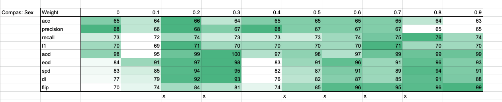
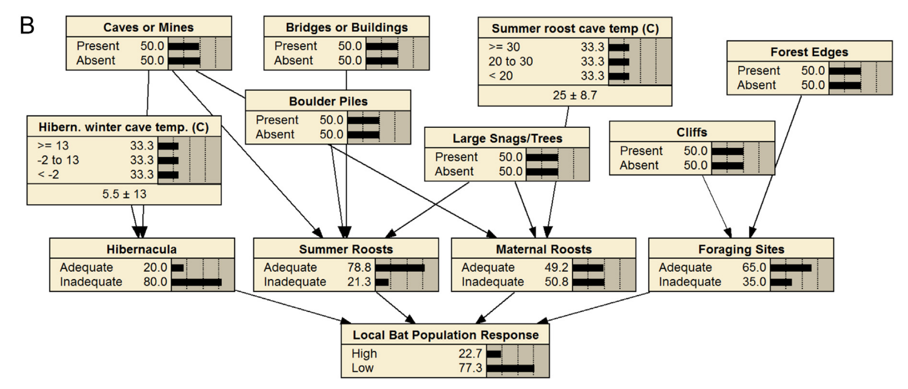

<a name=top>
       

&nbsp;<a href="https://git.io/sin21">home</a> ::
<a href="https://github.com/txt/sin21/blob/master/docs/syllabus.md#top">syllabus</a> ::
<a href="https://github.com/txt/sin21/blob/master/docs/syllabus.md#timetable">timetable</a> ::
<a href="https://docs.google.com/spreadsheets/d/1n0zHiZlVYkLAEg5Lj1CVaLSEaeNy8iYjw8IMWYWs4Tk/edit?usp=sharing">groups</a> ::
moodle(<a href="https://moodle-courses2122.wolfware.ncsu.edu/course/view.php?id=3211">591</a>,
<a href="https://moodle-courses2122.wolfware.ncsu.edu/course/view.php?id=3211">791</a>) ::
video <a href="https://ncsu.hosted.panopto.com/Panopto/Pages/Sessions/List.aspx#folderID=a5998f03-01df-4c6c-91c1-ad80003f3c7c">tbd</a> ::
<a href="https://github.com/txt/sin21/blob/master/LICENSE.md#top">&copy; 2021</a>
 

# Fair By Design

## Motivation for the following

Two reasons to explore all the above is that, after five years of software fairness testing,
that line of research may have run its course:

- It is not... ideal... that all that work is based on so few data sets. If we broadenned the scope of that work, would we be exploring a more useful and interesting space?
- https://arxiv.org/pdf/1912.00761.pdf argues that what ComSci and ML people call fairness is NOT what lawyers call fairness. So it might be time to look at the bigger picture.

So can we leap on to a broader definition of fairness?

## An (very specific) Example

How did he do it

Hint: not by hyper-parameter optimization (which is 
like walking around a car and hitting it till it works).

Instead of build a bad model, then fixing it, why not build the right
model in the first place?

## _Put_ theory
(Invented about 2 weeks ago by yours truly.)

Take data with columns:

- P : protected attributes
- U : unprotected attributes
- T : target attributes (may be many: multi-objective).

Cluster the rows:

- Ps :  using just the U attributed 
- Us :  using just the U attributed 
- Ts :  using just the U attributed 

If a  learner works, it finds what attributes select form what target values;
i.e.

- At the very least: large overlap Us and Ts

If a leaner is fair, then protected attributes do not determine the
target score:

- Small overlap Ps and Ts

Which means transitively:

- Small overlap Ps and Us

So a fair learner build from P
is one that is very good for predicting for the target (i.e.  be good at P2T)
and very bad at predicting for the protected attributes (.e. be bad at P2U).

## Significance:

- In-processing: 
  - learners could be modified to maximize for P2T (which is
     common practice) while minimizing P2U (which is a new idea).
  - Kewen's results (above) are an example of this analysis
- Pre-processing: 
  - The P2U connection could be determined looking at the data without
  access to any T.
  - Pre-processors that weakened the P2U connection (e.g. Joy's rebalancing)
    would generate data
    that, theoretically, no data could then be unfair about

## FairCart

(no, its not called "FART"

### CART

Before going further,  you need to know:

- Decision trees are recursive _diversity reduction_ algorithms
- Find the split that most reduces diversity
- Recurse on each split.
- Stop when (e.g.) too few examples in each split.

BTW, RandomForests says "if one tree is good, why not build 100?"

- each time, grab (say) log(N) of the attributes and some percent of the rows
- build N trees
- make a conclusion by voting across the forest

Example1

- let us measure diversity using _standard deviaton_ 
     - sqrt((&sum; square(x - &mu;))/(n-1))
- standard deviation &sigma; of 9,2,5,4,12,7 has &mu; = 6.5 and &sigma;=3.619.
- Learners like CART and M5prime and Random Forest Regressorts used standard deviation.
    - Why? Cause these learners predict for _numeric class variables_.

Example2:

- let us measure diversity using _entropy_; i.e. _-1* &sum; p*log2(p)_   
  e.g. 1 orange, 1 apple, 2 bananas, and 4 grapes 
- occur at probability 1/8, 1/8, 1/4, and 1/2
   - 8 =2\*2\*2 so log2( 1/8 ) = -3
   - 4 =2\*2 so log2( 1/4 ) = -2
   - 2 =2 so log2( 1/2 ) = -1
- what is entropy of (o,a,b,b,g,g,g,g) 
   - -1 \* (1/8\*-3 + 1/8\*-3 + 1/4\*-2 + 1/2\*-1)
   - = -1 * (1/8\*-3 + 1/8\*-3 + 2/8\*-2 + 4/8\*-1)
   - = -1/8 * (-6 + -4 + -4)  
   - = 14/8 
   - = 1.75 
- Learners like decision trees and random forests use entropy
- Why? Cause these learners predict for _symbolic class variables_.

Example3: 

- What is the best split for this data?

- Here are the options (note that this is four different splits):

- Consider the _outlook_ tree. We have three sub-branches so the _expected value_ of the diversity after the split is
  - 5/14 * entropy of sunny split 
  - 4/14 * entropy of overcast split 
  - 5/14 * entropy of rainy split 
- The overcast split is easy: 
  - we only have _yes_ so _p(yes)_ = 1 and log2(p) = 0
  - and 4/14 is zero
- The sunny and rainy split are symmetric
  - sunny: 2 yes and 3 no =     -1 * (2/5 * log2(2/5) + 3/5 * log2(3/5)) = 0.97
  - raning: 3 yes and 2 no = same entropy as sunny
- So the expected value after the outlook split is
  -  (5/14 * 0.97) + (4/14 * 0) + (5/14 * 0.97) = 0.69
  - (BTW, this is an improvement since before the split we have 9 yes, 5 no; ie. entropy was 0.94; i.e. **more** diversity).

If we repeat this calc over all splits, we get

- outlook split: 0.69
- temperate split: 0.91 
= humidity split:  0.79
- windy split: 0.89

So we would split on outlook.

### Under the hood

- https://github.com/txt/ase16/blob/master/src/ase.py#L989-L1039
- For an explanation of lines 10014 to 1017, see 3.3 of http://robotics.stanford.edu/users/sahami/papers-dir/disc.pdf
  - Long story short, when recursively diving dividing numbers, they use information theory to guide termiantion
  - Note that this is a top-down approach (whereas my preferred discretizer is bottom=-up... so simpler termination). 
   - See http://menzies.us/keys/range.html#section-15
- But to-down, botttom-up, the main point here is that there is n over-arching framework and smaller details withing
  - and that framework can be used for fairness - by design
- e.g. what kewen did was to score each range by its ability to predict for the goal (minimize target entropy) with _w_
  and maximizing protected attribute entropy (with _1-w_). Hence the above tabe

## Going further

Consider the following Bayes net. This is a bi-directional structure. Each node's distribution is the product of its parents.
If you adjust any distribution, then the upstream and downstream distributions adjust to be be consistent.

Note that if a node has more than one parent, it is _non-determinate_ what happens when you change something downstream  (which upstream variable do you fiddle)?
That is:

- updates lead to choices
- choices could be assessed by fairness predicates.

E.g. 

Just as we can adjust decision tree generate to enable fair-by-design, so too can we adjust other AI tools.  What would it mean to tinker with out kodels,
watch for the assumptions that tinkering might generate, then explroe tthat assumptions space.

Welcome back to abduction.
When reasoning about 
symbols across rules, abduction tells us we can generate multiple interpretations.
For example:

- Grass is wet if it rained.
- Grass is wet if the sprinkler was on.
- The sun was shining.
-  false if it rained and the sun was shining.

(The last item is an integrity constraint.)
Then given "the grass is wet" then  the worlds of belief are "it rained" and "the sprinkler was on". But it we new the sun was shining then the integrity constraint would rule out raining.

Here's a more complex example:

    feed(lactose) :- make(permease), make(galactosidase).
    make(Enzyme) :- code(Gene, Enzyme), express(Gene).
    express(lac(X)) :- amount(glucose, low), amount(lactose, hi).
    express(lac(X)) :- amount(glucose, medium), amount(lactose, medium).
    code(lac(y), permease).
    code(lac(z), galactosidase).
    temperature(low) :- amount(glucose, low).

Integrity constraints (IC)

    false :- amount(S, V1), amount(S, V2), V1 ≠ V2.

Abducibles (A) (things we are allowed to guess).

    abducible_predicate(amount).

The problem goal is _feed(lactose)_. This can arise either as an observation to be explained or as a state of affairs to be achieved by finding a plan. This goal has two 
abductive explanations:

- amount(lactose, hi), amount(glucose, low)}\\\Delta 
- lactose, medium), amount(glucose, medium)

Here again, we are exploring some model and we find choices. Without any knowledge of local goals, we have to just throw a coin and make decisions that might be bad:

- https://www.dropbox.com/s/yb5cekch9i8oy87/paper14.pdf?dl=0#page=7

